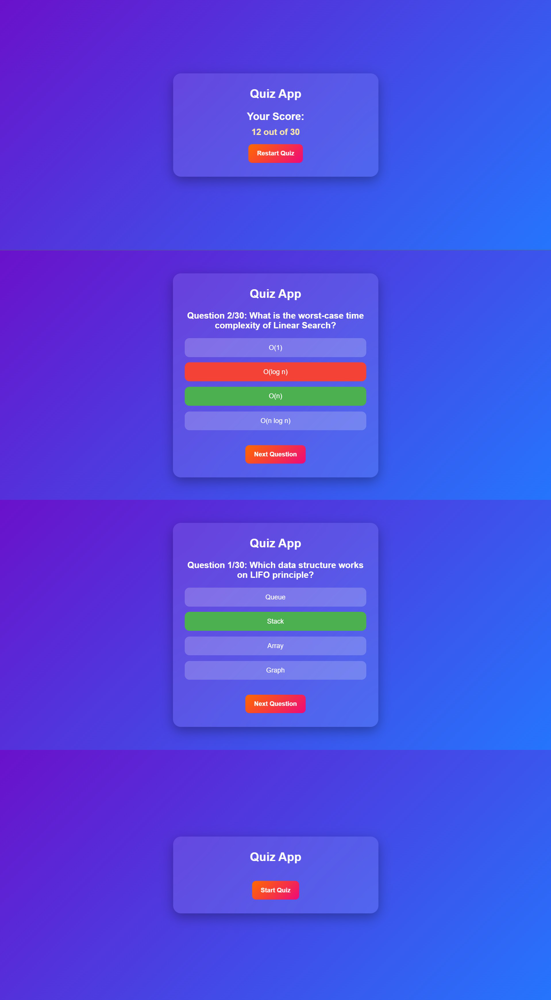

# 🧠 Mini Quiz App (HTML, CSS & JavaScript)

Welcome to the **Mini Quiz App** — a simple, interactive quiz project built using **HTML, CSS, and JavaScript**.  
It helps users test their knowledge in a fun and engaging way with instant score results.

---

## 🚀 Features

✅ Interactive and responsive design  
✅ Displays multiple-choice questions  
✅ Shows score at the end of the quiz  
✅ Dynamic question loading using JavaScript  
✅ Clean and beginner-friendly code  

---

## 🧩 Tech Stack

🧱 **HTML5** – Structure of the quiz  
🎨 **CSS3** – Styling and layout  
⚙️ **JavaScript (ES6)** – Logic, score calculation, and interactivity  

---

## 📸 Preview 



---

## 💻 How to Run

1️⃣ **Clone the repository**  
     ```bash
        git clone https://github.com/pandeyvivek008/WDR-LAB-Mini-App.git
2️⃣ **Open the folder in VS Code or any code editor**
3️⃣ **Run the index.html file in your browser**
4️⃣ **Enjoy the quiz 🎯**

📚 Learning Outcomes
  - Understanding DOM manipulation
  - Working with arrays and objects in JavaScript
  - Implementing quiz logic (score, options, next question, etc.)
  - Building a simple project structure for web apps

## 🧩 Author

👨‍💻 **Vivek Pandey**  
📧 **pandeyvivekworks@gmail.com**  
🔗 [LinkedIn Profile](https://www.linkedin.com/in/upwithvivekpandey)

⭐ **Don’t forget to star this repo if you found it helpful!**
